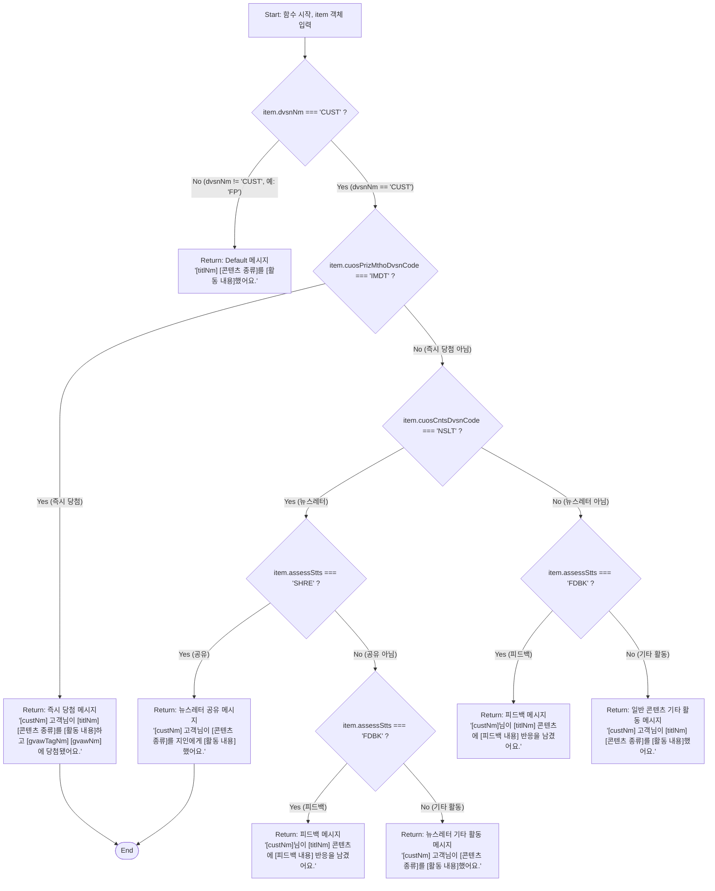

```mermaid
graph TD
    A[Start: 함수 시작, item 객체 입력] --> B{item.dvsnNm === 'CUST' ?};

    B -- No (dvsnNm != 'CUST', 예: 'FP') --> Z["Return: Default 메시지<br>'[titlNm] [콘텐츠 종류]를 [활동 내용]했어요.'"];
    B -- Yes (dvsnNm == 'CUST') --> C{item.cuosPrizMthoDvsnCode === 'IMDT' ?};

    C -- Yes (즉시 당첨) --> D["Return: 즉시 당첨 메시지<br>'[custNm] 고객님이 [titlNm] [콘텐츠 종류]를 [활동 내용]하고 [gvawTagNm] [gvawNm]에 당첨됐어요.'"];
    C -- No (즉시 당첨 아님) --> E{item.cuosCntsDvsnCode === 'NSLT' ?};

    E -- Yes (뉴스레터) --> F{item.assessStts === 'SHRE' ?};
    E -- No (뉴스레터 아님) --> K{item.assessStts === 'FDBK' ?};

    F -- Yes (공유) --> G["Return: 뉴스레터 공유 메시지<br>'[custNm] 고객님이 [콘텐츠 종류]를 지인에게 [활동 내용]했어요.'"];
    F -- No (공유 아님) --> H{item.assessStts === 'FDBK' ?};

    H -- Yes (피드백) --> I["Return: 피드백 메시지<br>'[custNm]님이 [titlNm] 콘텐츠에 [피드백 내용] 반응을 남겼어요.'"];
    H -- No (기타 활동) --> J["Return: 뉴스레터 기타 활동 메시지<br>'[custNm] 고객님이 [콘텐츠 종류]를 [활동 내용]했어요.'"];

    K -- Yes (피드백) --> L["Return: 피드백 메시지<br>'[custNm]님이 [titlNm] 콘텐츠에 [피드백 내용] 반응을 남겼어요.'"];
    K -- No (기타 활동) --> M["Return: 일반 콘텐츠 기타 활동 메시지<br>'[custNm] 고객님이 [titlNm] [콘텐츠 종류]를 [활동 내용]했어요.'"];

    D --> End([End]);
    G --> End;
```
